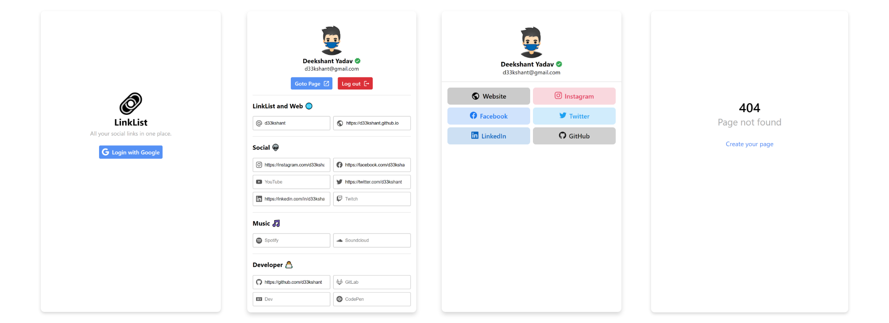

# LinkList
[LinkTree](https://linktr.ee/) clone made with Next.js and Firebase

## Screenshots

## Features
- Mobile First Design
- Firebase Authantication
- Custom Username Routes
- Realtime Link Update
- 404 Page for User not found
## Project & Firebase Setup
1. Clone this repo and inatall node modules from `package.json`
2. Create a firebase project and add an web app in your project.
3. Copy the configs and paste them in new file `firebase-config.js` in root level of the project.
4. Start the auth service in your firebase project and add Google as auth provider.
5. Start the firestore service with any sever location of your choise.
6. start the development server buy running `yarn dev`